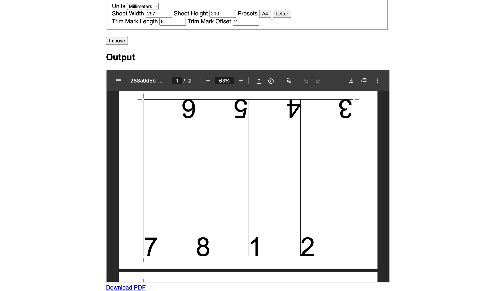

# F-Impose

F-impose is a set of web-based PDF imposition tools made for indie printmaking. Try it out: https://gfrancine.github.io/f-impose/

## Features

As of now, these layouts are supported:

- 8-fold mini zines (trim marks supported)
- Saddle stitch booklets, 2-up
- Saddle stitch booklets, 4-up
- Business cards, 8-up
- Repeating grid imposition (set columns & rows)

And comes with several print utilities:

- Remove inner/spine bleeds
- Add trim marks
- Convert short/long edge documents
- Reduce opacity/ink usage

And it can also:

- Batch-process multiple files at once
- Merge the results into a single PDF file
- Chain multiple layouts and steps together
- Generate dummy page-numbered PDFs for proofing/testing

# Contributing

To suggest features or report issues, please [create an issue](https://github.com/gfrancine/f-impose/issues) in this repository or [message me personally](https://instagram.com/gracefrancines)! Also check out the [development roadmap](https://github.com/users/gfrancine/projects/4/views/1) to see if something is planned or actively being worked on.

If you'd like to contribute directly to the source code, see [Developing.md](./docs/Developing.md) in the `docs/` folder to get started.

# Copyright

(c) 2026 Grace Francine (https://github.com/gfrancine)
